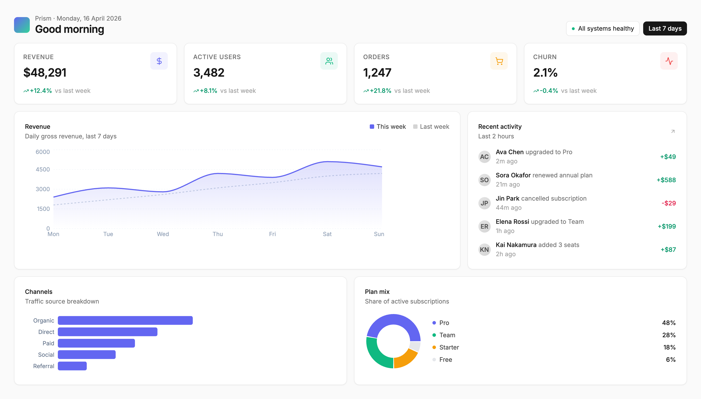
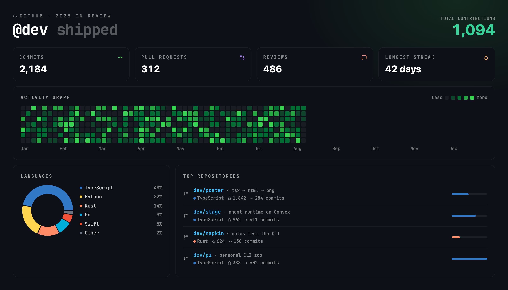
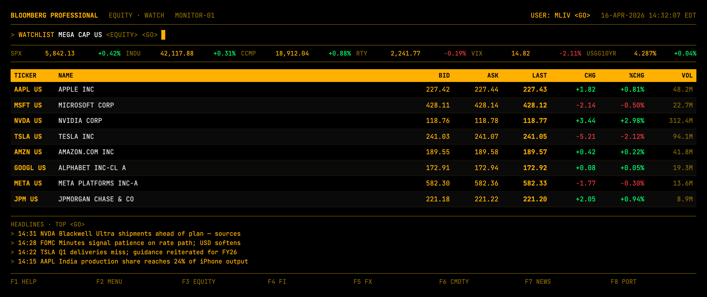
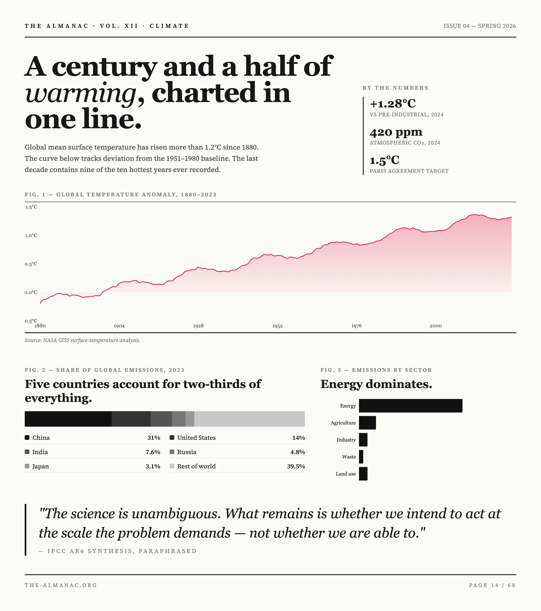
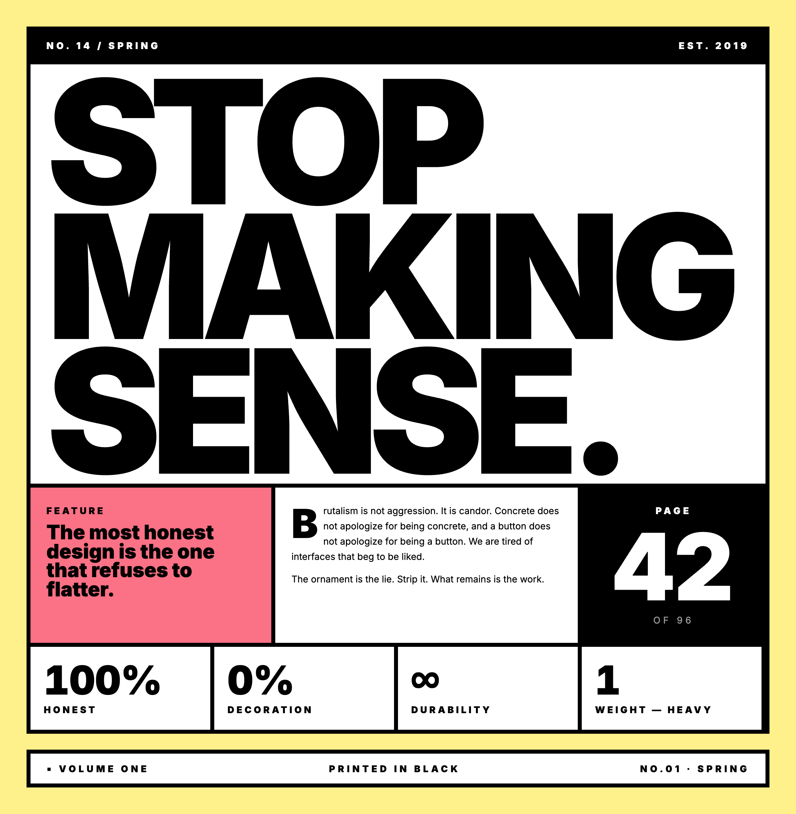
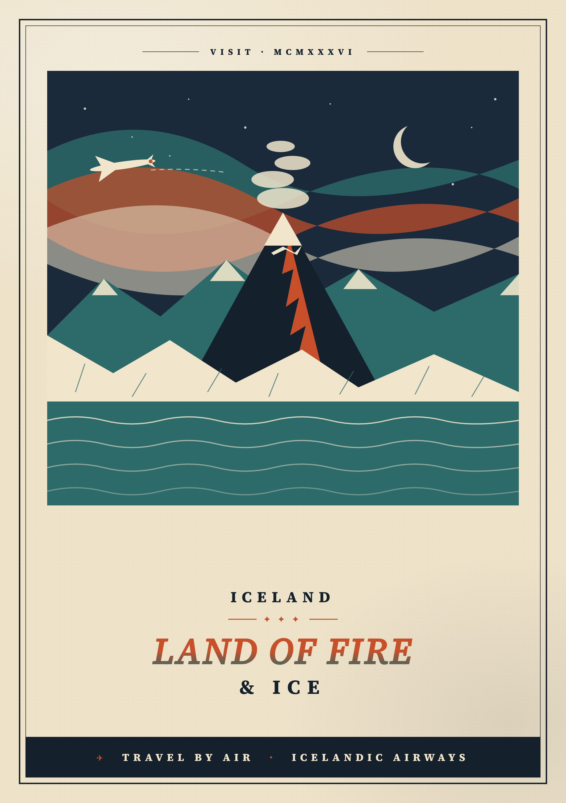
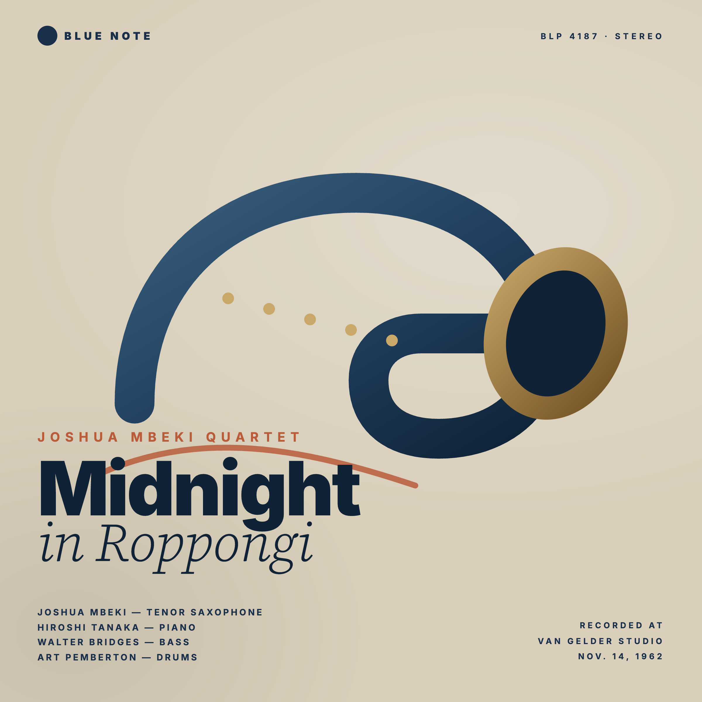
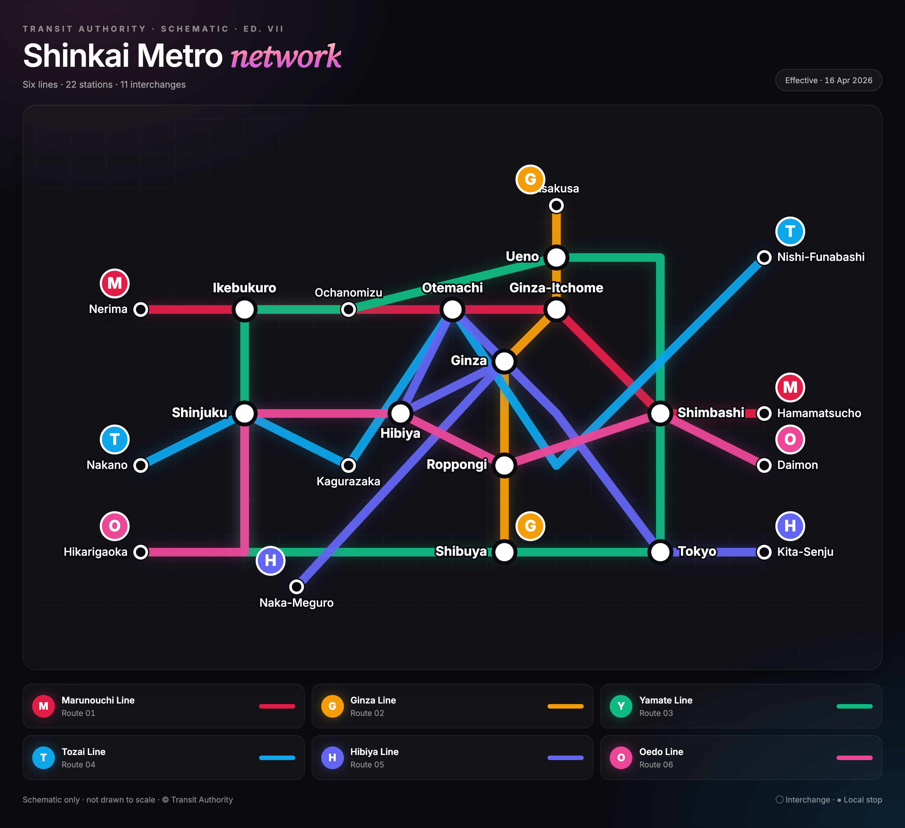

# pi-poster

🎨 [Poster](https://github.com/Michaelliv/poster) for [pi](https://github.com/badlogic/pi-mono) — turn agent intent into a rendered image.

Give pi the ability to author a single-file React poster and render it to **PNG / SVG / PDF / JPG / WebP** during a session. Tailwind, Recharts, lucide-react, Inter / Source Serif 4 / JetBrains Mono — all available out of the box.

```
"Make me a share image for the v0.2 release" → hero PNG
"One-page PDF report from this CSV"          → editorial layout → PDF
"Year-in-review for our top 10 customers"    → wrapped-style story poster
"OG image for the new docs site"             → 1200×630 social card
"Cover for this README"                      → README hero
```

## Install

```bash
pi install npm:pi-poster
```

That's it. `poster-ai` ships a headless Chromium binary, so the first render is ready to go.

## How the agent uses it

One tool, **`poster_render`**, with two ways to source the TSX:

| Param | When | Why |
|---|---|---|
| `tsx` | First render | Inline source string. The agent authors a fresh component. |
| `tsxPath` | Iterative edits | Path to a `.tsx` file. The agent edits the previously-archived source instead of resending the whole component. |

The two are mutually exclusive — pass exactly one.

### First render (inline)

```
poster_render({
  tsx: `
    export default () => (
      <div className="w-[1200px] p-12 bg-black text-white">
        <div className="text-[14px] font-bold uppercase tracking-[0.3em] text-cyan-300/70">
          Release · v0.2
        </div>
        <h1 className="text-7xl font-black mt-3">Shipped.</h1>
      </div>
    )
  `,
  out: "./release.png"
})

→ Rendered /Users/you/proj/release.png · 24.3 KB · 1200×180 · png
```

### Iterative edit (by path)

Every render archives a paired `<name>-<ts>.{format,tsx}` into `.poster/output/`. To iterate, the agent edits that `.tsx` file directly and re-renders by path — no need to resend the whole component each turn.

```
poster_render({
  tsxPath: ".poster/output/release-1776359608903.tsx",
  out: "./release.png"
})
```

### Canvas comes from the TSX

There is **no** `width` / `height` tool param. The root element declares the canvas via Tailwind:

```tsx
<div className="w-[1600px] p-10 ...">             // landscape / dashboard / twitter
<div className="w-[1200px] p-10 ...">             // square / cover / instagram
<div className="w-[1080px] p-10 ...">             // story / wrapped
<div className="w-[1400px] p-10 ...">             // editorial / magazine
<div className="w-[1200px] h-[630px] p-10 ...">   // OG image (the only fixed-aspect case)
```

One source of truth. Two sources = overflow + empty-strip bugs.

## What the agent gets, for free

- **`poster` skill** — authoring contract, layout grammar, color systems, signature patterns (kicker rows, italic reveal words, gradient text, card recipes), and a catalog of pitfalls. Loaded automatically when the agent reaches for a visual deliverable.
- **Pre-flight validation** — broken canvases (`min-h-screen`, `w-full` on root, illegal font sizes, percentage-height traps) are caught before the puppeteer launch, with concrete fix suggestions in the error.
- **Inline preview** — when the terminal supports images, the rendered PNG/JPG/WebP appears directly under the tool result.
- **Source archive** — `.poster/output/<name>-<ts>.{ext,tsx}` keeps the full history of what the agent produced. Add `.poster/` to `.gitignore` if you don't want it in version control.

## What posters look like

Every one of these is a single `.tsx` file the agent can author the same way — click any source link to see exactly what the model produced.

<table>
  <tr>
    <td width="50%" valign="top"><a href="examples/dashboard.png"></a></td>
    <td valign="top"><strong><code>dashboard</code></strong> · <a href="examples/dashboard.tsx">source</a><br/><br/><sub>Single-page analytics dashboard — area + bar charts, top-customer table, traffic source breakdown, KPI tiles. Dark theme with gradient fills, precise tabular numbers.</sub></td>
  </tr>
  <tr>
    <td valign="top"><a href="examples/devwrap.png"></a></td>
    <td valign="top"><strong><code>devwrap</code></strong> · <a href="examples/devwrap.tsx">source</a><br/><br/><sub>Developer year-in-review poster — GitHub-style contribution heatmap, language mix donut, top repos, KPI tiles for commits / PRs / reviews / longest streak. Code-tool aesthetic.</sub></td>
  </tr>
  <tr>
    <td valign="top"><a href="examples/bloomberg.png"></a></td>
    <td valign="top"><strong><code>bloomberg</code></strong> · <a href="examples/bloomberg.tsx">source</a><br/><br/><sub>Market dashboard styled like a Bloomberg Terminal — black background, monospaced amber-on-black, dense rows of tickers with bid / ask / last / chg / vol.</sub></td>
  </tr>
  <tr>
    <td valign="top"><a href="examples/editorial.png"></a></td>
    <td valign="top"><strong><code>editorial</code></strong> · <a href="examples/editorial.tsx">source</a><br/><br/><sub>Tall editorial data-story magazine spread on climate emissions — magazine-grade typography, inline charts, pull quotes, target-line annotations. Long-form data journalism feel.</sub></td>
  </tr>
  <tr>
    <td valign="top"><a href="examples/brutalist.png"></a></td>
    <td valign="top"><strong><code>brutalist</code></strong> · <a href="examples/brutalist.tsx">source</a><br/><br/><sub>Brutalist product spec card — flat saturated yellow, white inner panel with thick black borders, all-caps Inter, hard rectangles. 1990s industrial parts catalog energy.</sub></td>
  </tr>
  <tr>
    <td valign="top"><a href="examples/travelposter.png"></a></td>
    <td valign="top"><strong><code>travelposter</code></strong> · <a href="examples/travelposter.tsx">source</a><br/><br/><sub>1930s WPA-style travel poster for 'Iceland — Land of Fire and Ice' — flat geometric mountains and aurora, art deco type, limited 4-color palette, cream paper texture.</sub></td>
  </tr>
  <tr>
    <td valign="top"><a href="examples/vinyl.png"></a></td>
    <td valign="top"><strong><code>vinyl</code></strong> · <a href="examples/vinyl.tsx">source</a><br/><br/><sub>Square Blue Note Records-style jazz album cover — cool muted palette, bold sans serif credits, generous whitespace, one big abstract shape suggesting horns.</sub></td>
  </tr>
  <tr>
    <td valign="top"><a href="examples/subway.png"></a></td>
    <td valign="top"><strong><code>subway</code></strong> · <a href="examples/subway.tsx">source</a><br/><br/><sub>Tokyo subway-map style schematic — 6 colored transit lines with named stations and interchange points. Geometric, 45° / 90° angles only, line legend, route numbers in colored circles.</sub></td>
  </tr>
</table>

For 40+ more examples — anatomy diagrams, neon synthwave, NYT-style crosswords, tarot cards, illuminated manuscripts, weather widgets, sankey flows — see the full [poster-ai gallery](https://github.com/Michaelliv/poster#gallery).

## License

MIT
